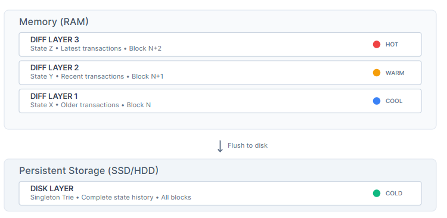

# Quranium Technical Writing Assessment

**Candidate:** Antony William


## Table of Contents

- [Part 1: Geth (Go Ethereum) Technical Overview](#part-1-geth-go-ethereum-technical-overview)
  - [Before You Begin](#before-you-begin)
  - [What Is Geth?](#what-is-geth)
  - [Key Characteristics](#key-characteristics)
  - [Architecture Overview](#architecture-overview)
    - [Dual-Client Design](#dual-client-design)
    - [Core Components](#core-components)
  - [Key Functionalities](#key-functionalities)
    - [Transaction Processing](#transaction-processing)
    - [Synchronization Methods](#synchronization-methods)
  - [Challenges And Solutions](#challenges-and-solutions)
- [Part 2: Code Commentary (Python + C++)](#part-2-code-commentary-python--c)
  - [Python Snippet Analysis](#python-snippet-analysis)
    - [Original Code](#original-code)
    - [Issues Identified](#issues-identified)
    - [Improved Version](#improved-version)
    - [Key Improvements Made](#key-improvements-made)
  - [C++ Snippet Analysis](#c-snippet-analysis)
    - [Original Code](#original-code-1)
    - [Issues Identified](#issues-identified-1)
    - [Improved Version](#improved-version-1)
    - [Key Improvements Made](#key-improvements-made-1)

---

## Part 1: Geth (Go Ethereum) Technical Overview

**Target:** 600-800 words | **Audience:** Developers new to protocol-level infrastructure

### Before You Begin

To gain the most from this document, possess a foundational understanding of these concepts:

> 💡 **Prerequisites Checklist:**
> - **Basic Programming Knowledge:** You write, read, and debug simple code. You grasp basic logical flow and data manipulation. (e.g., automating tasks with scripts).
> - **General Blockchain Principles:** You understand a blockchain is a distributed, immutable record of transactions, secured by cryptography. (e.g., how Bitcoin transactions verify across a network).
> - **Understanding Command-Line Interfaces (CLI):** You interact with your computer's operating system using terminal commands. (e.g., using `cd` to change directories, or `ls` to list files).

### What Is Geth?

Geth (Go Ethereum) is the leading open-source implementation of the Ethereum protocol, written in Go. This crucial execution client allows you to run Ethereum nodes, interact with the blockchain, deploy smart contracts, and contribute to network decentralization. Geth handles the core logic of the blockchain.

### Key Characteristics

**Main differences between Geth and other Ethereum clients:**

||**Geth (Go)**|**Erigon (Go)**|**Nethermind (C#)**|**Besu (Java)**|
|---|---|---|---|---|
|**Language**|**Go**|**Go**|**C#**|**Java**|
|**Market Share**|**~70%**|**~15%**|**~10%**|**~5%**|
|**Sync Speed**|**Fast** (Snap Sync)|**Very Fast** (Staged Sync)|**Fast**|**Moderate**|
|**Storage Requirements**|**Standard** (~800GB)|**Optimized** (~400GB)|**Standard**|**Standard**|
|**Resource Usage**|**Moderate**|**High** (CPU intensive)|**Moderate**|**High** (JVM overhead)|

> ℹ️ **Key Benefits:**
> Geth functions as an execution client in Ethereum's post-Merge architecture, handling transaction processing and state management. It supports Proof-of-Stake (PoS) consensus and integrates with consensus clients via the Engine API.

**Real-world example:** If you build a decentralized finance (DeFi) application, Geth connects your app to the Ethereum blockchain. It helps you send transactions, verify token balances, and interact with lending protocols.

## Architecture Overview

### Dual-Client Design

Post-Merge Ethereum requires two clients: an execution client (Geth) and a consensus client. Geth handles transaction processing, state management, and EVM execution. It communicates with consensus clients through the Engine API. This modular approach enhances security and enables client diversity.

### Core Components

> **Geth's internal architecture comprises several key functional areas:**

**Ethereum Virtual Machine (EVM):** The `core/vm` package implements the EVM. This is the runtime environment for smart contracts. Geth's EVM executes smart contract bytecode, handling state transitions and ensuring deterministic results across all nodes.

**Blockchain State Management:** The `core/state` and `triedb` packages maintain the world state. This includes all accounts, balances, and smart contract storage. Geth uses a Merkle Patricia Trie structure (`trie` package) for efficient, verifiable state storage.




**Figure 1: Geth's Layered State Storage Model**

This diagram visually represents Geth's layered state storage architecture. The "Disk layer (singleton trie)" acts as the persistent base, while multiple "diff layers" remain in memory, tracking recent modifications. This layered approach enables efficient state updates, blockchain reorganization handling, and supports features like state pruning.

**Networking (P2P):** The `p2p` package manages peer-to-peer communication within the Ethereum network. It handles node discovery, establishes connections, and propagates blocks and transactions via the RLPx protocol.

**JSON-RPC API:** The `rpc` and `eth` packages provide the developer interface. This allows external applications to interact with the Geth node. This API exposes methods for querying blockchain data, sending transactions, and managing accounts.

**Database (ethdb):** Geth primarily uses a key-value store (LevelDB or PebbleDB) to persist blockchain data. This includes blocks, transactions, receipts, and state tries.

**Transaction Pool (core/txpool):** This component manages pending transactions. It handles validation, prioritization, and propagation of transactions before inclusion in a block.

## Key Functionalities

### Transaction Processing

Geth plays a central role in transaction processing:

1. **Transaction Validation:** Upon receiving a transaction, Geth validates its format, signature, nonce, and sufficient balance before adding it to the transaction pool.

2. **Block Construction and Validation:** As an execution client, Geth prepares execution payloads. These are lists of transactions for consensus clients to propose blocks.

3. **State Transitions:** Each transaction execution leads to a state transition. The world state updates according to EVM rules.

### Synchronization Methods

**Comparison of Geth sync modes:**

||**Full Sync**|**Snap Sync**|**Light Sync**|**Archive Node**|
|---|---|---|---|---|
|**Time to Sync**|**Days/Weeks**|**Hours**|**Minutes**|**Weeks**|
|**Storage Required**|**~800GB**|**~800GB**|**<1GB**|**10+ TB**|
|**Security Level**|**High**|**High**|**Medium**|**Highest**|
|**Use Case**|**Full validation**|**Recommended**|**Mobile/Light apps**|**Historical analysis**|

> ⭐ **Recommended:** Snap Sync is the default and recommended sync mode for most users.

## Challenges And Solutions

Running and maintaining a Geth node presents several challenges:

> ⚠️ **Common Issues & Solutions:**

**High Resource Consumption**
- **Problem:** Full nodes demand significant CPU, RAM, and fast SSD storage
- **Solution:** Use `--cache` flag to optimize memory and `--datadir` for storage management

**Initial Synchronization Time**
- **Problem:** Historical full sync could take weeks
- **Solution:** Snap Sync reduces sync time from days to hours

**State Growth**
- **Problem:** Ethereum state continues growing, impacting storage
- **Solution:** State pruning options discard old, unneeded data

**Network Connectivity**
- **Problem:** "Geth unable to find peers" prevents synchronization
- **Solution:** Manual bootnode specification and robust peer discovery

> 💡 **Pro Tip:** Always ensure proper Engine API setup between Geth and your consensus client to avoid "No beacon client detected" errors.

---

## Part 2: Code Commentary (Python + C++)

### Python Snippet Analysis

Here is a simple Python function that reads data from a file.

#### Original Code

```python
def read_data_from_file(filename):
    # This function reads data from a file
    f = open(filename, "r")
    data = f.read()
    f.close()
    return data
```

#### Issues Identified

> **Critical Problems:**

**No Error Handling:** A `FileNotFoundError` will crash the program  
**Real-World Impact:** Like a car suddenly running out of gas without warning

**Resource Leak Risk:** File handle won't close if `read()` fails  
**Real-World Impact:** Like leaving a water tap running after filling a glass

**Poor Documentation:** Comment adds no value  
**Real-World Impact:** Like a sign saying "This is a door" on a door

**Missing Encoding:** Could cause cross-platform issues  
**Real-World Impact:** Like reading a foreign document without knowing its character set

#### Improved Version

```python
def read_data_from_file(file_path: str) -> str:
    """
    Reads the entire content of a text file safely.
    
    This function opens and closes the file, handling common
    file-related errors to prevent program crashes.

    Args:
        file_path: Path to the text file to read.

    Returns:
        File content as a string.

    Raises:
        FileNotFoundError: If the file does not exist.
        IOError: For other file operation errors.
    """
    try:
        with open(file_path, "r", encoding="utf-8") as file_handle:
            return file_handle.read()
    except FileNotFoundError:
        print(f"Error: File '{file_path}' not found.")
        raise
    except IOError as e:
        print(f"Error reading file '{file_path}': {e}")
        raise
```

> **Real-World Example:**
> 
> **Scenario:** You're building a configuration loader for a web application that reads database connection settings from `config.json`.
> 
> **Before:** When `config.json` is missing, your entire web server crashes during startup with an unclear error, leaving users unable to access the website.
> 
> **After:** The improved function catches the missing file, logs a clear error message "Error: File 'config.json' not found", and allows your application to either use default settings or show a helpful setup wizard to create the configuration file.

#### Key Improvements Made

> **Enhancement Highlights:**

**Comprehensive Docstring:** Detailed PEP 257 documentation  
**Benefit:** Clear instruction manual explaining functionality

**Robust Error Handling:** `try-except` blocks with informative messages  
**Benefit:** "Check engine" light with diagnostic information

**Safe Resource Management:** `with` statement ensures automatic cleanup  
**Benefit:** Automatic shut-off valve for resource management

**Encoding Specification:** UTF-8 for cross-platform compatibility  
**Benefit:** Universal document readability

### C++ Snippet Analysis

Here is a simple C++ function that calculates a rectangle's area.

#### Original Code

```cpp
#include <iostream>

int calcArea(int l, int w) {
    // calculate area
    return l * w;
}

int main() {
    int len = 10;
    int wid = 5;
    int a = calcArea(len, wid);
    std::cout << "Area is: " << a << std::endl;
    return 0;
}
```

#### Issues Identified

> **Code Quality Issues:**

**Poor Naming:** Single-letter parameters obscure meaning  
**Real-World Impact:** Like vague blueprint abbreviations

**No Input Validation:** Negative dimensions produce nonsensical results  
**Real-World Impact:** Calculator accepting negative physical lengths

**Minimal Documentation:** Comments add no meaningful information  
**Real-World Impact:** Manual saying "Press button" without explanation

#### Improved Version

```cpp
#include <iostream>
#include <stdexcept>

/**
 * @brief Calculates rectangle area with input validation.
 *
 * This function takes the length and width of a rectangle as input.
 * It returns its area. It performs basic validation to ensure
 * dimensions are non-negative.
 *
 * @param length Rectangle length. This must be non-negative.
 * @param width Rectangle width. This must be non-negative.
 * @return The calculated area.
 * @throws std::invalid_argument If either length or width is negative.
 */
int calculateRectangleArea(int length, int width) {
    if (length < 0 || width < 0) {
        throw std::invalid_argument("Rectangle dimensions cannot be negative.");
    }
    return length * width;
}

int main() {
    try {
        int rectangleLength = 10;
        int rectangleWidth = 5;
        int area = calculateRectangleArea(rectangleLength, rectangleWidth);
        std::cout << "Area: " << area << std::endl;
    } catch (const std::invalid_argument& e) {
        std::cerr << "Error: " << e.what() << std::endl;
    }
    return 0;
}
```

> **Real-World Example:**
> 
> **Scenario:** You're developing a floor planning software for an architecture firm where users input room dimensions to calculate square footage for material estimates.
> 
> **Before:** When an architect accidentally enters -5 for room width (perhaps a data entry error), the function returns -50 square feet. This gets passed to the material calculator, which orders negative amounts of flooring, causing a $10,000 ordering system error and project delays.
> 
> **After:** The improved function immediately catches the invalid input, displays "Error: Rectangle dimensions cannot be negative," and prompts the user to re-enter valid dimensions. The architecture firm avoids costly mistakes and maintains accurate project estimates.

#### Key Improvements Made

> **Professional Enhancements:**

**Detailed Documentation:** Doxygen-style comprehensive comments  
**Benefit:** Complete user manual for code functionality

**Meaningful Naming:** Descriptive function and variable names  
**Benefit:** Clear machine part labeling for easy identification

**Input Validation:** Safety mechanisms with exception handling  
**Benefit:** Prevents invalid data entry with clear error messages

---

**Was this assessment helpful?**
|[✅ Yes](#)|[❌ No](#)|
|---|---|

> 💬 **Feedback:** If you have questions about any section or need clarification on technical concepts, please don't hesitate to reach out!
